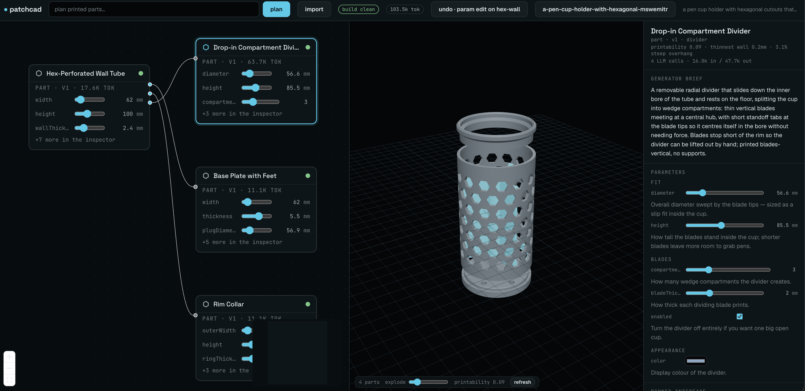

# patchcad

> **⚠️ In development — very early version.** This is a working slice of a much
> larger vision. Expect rough edges, missing features, breaking changes without
> notice, and fast-moving internals. See [Status & limitations](#status--limitations)
> before trying it.



*"A pen cup holder with hexagonal cutouts that is 75mm wide, to be 3D printed" —
the architect planned four printed parts with pinned contracts, each generated
hermetically and gate-verified against its own geometry. The inspector shows the
divider's parameters as the architect grouped and described them; every slider
re-executes through the geometry kernel with zero LLM calls.*

Prompt-to-app on a TouchDesigner-style node canvas. Type a goal → an architect
model plans a **graph of nodes with pinned interface contracts** → parallel
generators write each node's code hermetically (they see neighbors'
*contracts*, never their code) → the assembled app runs in a live preview.
Break out any node and reprompt it individually; contract changes mark
downstream nodes dirty for re-cook.

## Status & limitations

Actively in development; nothing here is stable. Current known limits:

- **Planning is slow and silent** — the architect call takes ~1–2 minutes with
  no progress feedback yet. It has not hung; give it the time.
- **Bring your own models.** Generation quality depends on hosted frontier
  models (Anthropic or OpenRouter key). Local models via Ollama work for the
  plumbing, but small local models cannot reliably write valid build123d —
  every failure is caught, attributed, and surfaced, not fixed for free.
- **CAD planning only in the studio.** The web-app backend exists and runs
  existing projects, but the product focus is printed parts.
- **No export yet.** STEP/3MF/STL export, assembly clash checks (G5), and
  screws seating into their holes are on the roadmap, not in the build.
- **Smart segmentation is import-only.** Splitting a model into naturally
  separating, peg-jointed pieces works for imported meshes; generated parts
  can't split yet.
- **Printability is advisory.** The DfAM score (min-wall + overhang) flags
  risk; it never blocks a cook.
- **Local, single-user tool.** The server binds localhost with no auth. The
  undo stack lives in memory and clears on server restart.
- **Setup has two runtimes.** Node (pnpm) for the studio/server, Python via
  `uv` for the geometry kernel. The server spawns the kernel for you, but `uv`
  must be installed or nothing cooks. Developed on macOS; Windows works but is
  lightly tested (see [Windows notes](#windows-notes)).

## Run it

**Prerequisites:** Node **22+** (`node --version`), [pnpm](https://pnpm.io/installation),
and [uv](https://docs.astral.sh/uv/). `uv` installs Python 3.12 and build123d
into the kernel's own virtualenv — you do not install those yourself.

```sh
pnpm install
pnpm dev          # server :4100, studio :5173, preview :5174
```

Then open the URL Vite prints — http://localhost:5173.

You don't start the geometry kernel yourself: the server spawns
`uv run patchcad-kernel` on the first cook and reuses an already-healthy one if
you started it by hand. That first spawn is the slow one — `uv` downloads
Python 3.12, build123d and OCP before the workers come up, which can take
minutes on a cold machine (the client waits up to 180 s). To pay that cost up
front, or to work on the kernel itself:

```sh
cd packages/backend-cad/kernel
uv sync && uv run patchcad-kernel        # :8621
```

Switch projects from the welcome screen or the header's project button.
Approving a plan creates a fresh project under `projects/<goal-slug>/` and
switches to it — the loaded project is never overwritten.

The studio opens on a single question — describe the part you want, or bring
an STL/STEP/3MF you already have. Either creates a project under
`projects/<slug>/`. Open `examples/cad-clamp` from the welcome screen for a
hand-authored 3-node reference (plate + L-bracket + M4 screw): drag the param
sliders on nodes — **T0 edits never touch an LLM**, and the bracket's hole and
the screw's thread re-derive from the plate through T1 bindings.

## Enable planning + generation

Give the server a model provider (checked in this order):

```sh
export ANTHROPIC_API_KEY=sk-ant-...          # simplest
```

or `~/.patchcad/config.json`:

```jsonc
{ "claude":     { "apiKey": "sk-ant-..." } }                                  // native
{ "openrouter": { "apiKey": "sk-or-..." } }                                   // any vendor via one key
{ "local":      { "baseUrl": "http://localhost:11434/v1", "model": "qwen3-coder" } }  // Ollama, free/offline
```

Then type a goal in the studio's prompt bar. Planning targets **cad**
(build123d parts, three.js viewport) — the web-code backend still runs
existing app projects. Review the proposed patch
(nodes, contracts, params) → **approve & cook**. Every node generates in
parallel; statuses stream onto the canvas. Select a node and use the
reprompt box — requests route by tier:

- **T2** (fits the pinned contract): only that node re-cooks; neighbors are
  untouchable by construction. Cosmetic asks route here instantly, no
  classifier call.
- **T3** (needs an interface change, e.g. "expose an onReset export in your
  contract"): the architect renegotiates that node's contract and you get an
  approval card — the rationale, what changed, and how many nodes the change
  re-cooks. Nothing applies until you accept.

The header's project button lists every project under `examples/` and
`projects/` and switches between them live. While a T3 proposal is pending,
the canvas shows its blast radius — the target and every node the change
would re-cook get a dashed amber tint.

Every user edit (params, contracts, reprompts, accepts, reverts) is a
checkpoint: **⌘Z** (or the header's undo button) rolls the whole graph back
one step, hot-swapping the restored modules into the preview.

Model routing (defaults): architect → `claude-opus-5`, generators →
`claude-sonnet-5`, classifier → `claude-haiku-4-5`.

**Pick the model per role.** `models` works on all three providers; any role you
leave out keeps that provider's default, so you can pin just the generator:

```jsonc
{
  "claude": {
    "apiKey": "sk-ant-...",
    "models": { "generator": "claude-haiku-4-5" }   // cheap generators, opus architect
  }
}
```

For `local`, `model` stays the shorthand for every role and `models` overrides
individual ones — e.g. a 30B architect with a 7B generator:

```jsonc
{
  "local": {
    "baseUrl": "http://localhost:11434/v1",
    "model": "qwen2.5-coder:7b",
    "models": { "architect": "qwen3-coder:30b" }
  }
}
```

**Mix providers per role** with a `routing` map — the recommended hybrid is a
hosted architect with free local generators:

```jsonc
{
  "routing": { "architect": "claude", "generator": "local" },
  "claude":  { "apiKey": "sk-ant-..." },
  "local":   { "baseUrl": "http://localhost:11434/v1", "model": "qwen3-coder" }
}
```

**Node library.** Every successfully cooked, unspecialized node is captured to
`~/.patchcad/library/` keyed by its contract hash. When a plan lands on an
identical contract — any project, any time — the node is reused with zero
generator calls (the cached code is still verified). Seed it from an existing
project with `pnpm --filter @patchcad/server exec tsx src/seed-library.ts <dir>`.

**Costs stay visible**: a Σ-token/dollar chip in the header, per-node token
chips on the canvas, and a call/token breakdown in the inspector.

## Troubleshooting

**`TypeError: Failed to fetch` in the browser console.** The studio is up but
can't reach the server. In order:

1. Is the server actually running? `curl http://127.0.0.1:4100/api/health`
   should print `{"ok":true}`. If it doesn't, start the server on its own to
   see the crash the parallel `pnpm dev` output buried:
   `pnpm --filter @patchcad/server start`.
2. Is something already on :4100? Move it — `PATCHCAD_PORT=4200` on the server,
   `VITE_PATCHCAD_API=http://127.0.0.1:4200` on the studio.
3. Server on another machine or port? Point the studio at it with
   `VITE_PATCHCAD_API`.

**The viewport says "0 parts" after a plan succeeds.** Nothing cooked, which
almost always means the geometry kernel never came up. Check it with
`curl http://127.0.0.1:8621/health`. The server spawns it as `uv run
patchcad-kernel`, so the usual cause is **`uv` not installed or not on PATH** —
the server log says `cad kernel did not become healthy within 180s (is uv
installed?)`. A cold first spawn is also genuinely slow (uv pulls Python 3.12
and OCP); start it by hand once to watch that download finish.

**`No LLM provider configured` though `~/.patchcad/config.json` exists.** The
server logs what it resolved at boot: `[patchcad] llm provider: <id> (<source>)`.
If that line instead says *no llm provider*, the file is in the wrong place or
the JSON didn't parse. Print it back — `cat ~/.patchcad/config.json`, or
`type %USERPROFILE%\.patchcad\config.json` on Windows. Notepad is a repeat
offender here: it saves `config.json.txt` unless you pick **All Files**, and it
can prepend a UTF-8 BOM. `export ANTHROPIC_API_KEY=…` skips the file entirely
and is checked first.

**Vite prints `Failed to resolve dependency: react`.** `pnpm install` didn't
link cleanly — re-run it. On Windows pnpm needs symlink permission: enable
Developer Mode or install from an elevated shell.

**Planning seems to hang.** It takes ~1–2 minutes with no progress feedback.
It has not hung.

### Windows notes

- The config lives in your **home** directory, not the repo:
  `%USERPROFILE%\.patchcad\config.json`. Create the folder first with
  `mkdir %USERPROFILE%\.patchcad`.
- Open the studio at the URL Vite prints and don't rewrite the host. On Windows
  `localhost` usually resolves to IPv6 `::1`, and Vite binds only that; the
  studio derives the API origin from `location.hostname` so the pair always
  agree. Swapping in `127.0.0.1` by hand is what breaks it.
- Some terminals truncate long log lines. If a log reads as though it stops
  mid-sentence, capture it before debugging off it: `pnpm dev > log.txt 2>&1`.

## Layout

```
packages/shared            types + zod schemas + hashing (the persisted graph format)
packages/engine            domain-agnostic core: graph store, contract diffing,
                           port-granular dirty propagation, architect pass, cook scheduler,
                           DomainBackend + LlmProvider interfaces
packages/backend-code      web-app backend: prompts, esbuild execute, contract verify,
                           workspace assembler, Vite preview adapter (HMR = hot-swap)
packages/backend-cad       CAD backend: ports-in-SE(3) + envelope contract schema,
                           KernelClient, and kernel/ — the Python geometry service
                           (uv + FastAPI + build123d; isolated warm workers, G0–G2
                           gates, GLB out; see kernel/README.md)
packages/llm-claude        Anthropic adapter (structured outputs + client-side validation)
packages/llm-openai-compat OpenRouter / Ollama / LM Studio adapter
packages/preview-runtime   in-iframe runtime: live params, per-node error boundaries
apps/server                Fastify: project persistence, plan/cook/reprompt API, WS events
                           (fixtures/shop = web-code graph the TS-verifier smoke test runs on)
apps/studio                React Flow canvas, inspector, plan approval, live preview pane
examples/cad-clamp         hand-authored 3-node CAD reference (plate + L-bracket + M4 screw)
```

## Project file format

```
<project>/patchcad.json               graph minus code bodies (git-friendly)
<project>/nodes/<id>/v<N>.code.tsx    one file per node version
<project>/.preview/                   regenerable Vite workspace (gitignored)
```

Full design doc: `~/.claude/plans/happy-beaming-tulip.md` (architecture,
tier routing T0–T3, CAD track, milestones).
